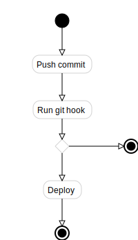
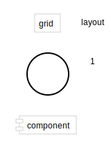

[go-design](https://godoc.org/github.com/gregoryv/go-design) - package for writing software design diagrams

- Cross platform
- No external dependencies
- SVG output

Program your diagrams and refactoring automatically updates them.
Take a look at the below examples and then browse the [showcase](./showcase/README.md) of golang standard packages.

## Sequence diagram

    var (
        d   = design.NewSequenceDiagram()
        cli = d.AddStruct(app.Client{})
        srv = d.AddStruct(app.Server{})
        db  = d.AddStruct(sql.DB{})
    )
    d.Link(cli, srv, "connect()")
    d.Link(srv, db, "SELECT").Class = "highlight"
    d.Link(db, srv, "Rows")
    d.Link(srv, srv, "Transform to view model").Class = "highlight"
    d.Link(srv, cli, "Send HTML")

## Activity diagram

Rendered by
[example_test.go/ExampleActivityDiagram](https://godoc.org/github.com/gregoryv/go-design/#example-ActivityDiagram)

## Class diagram

Class diagrams show relations between structs and
interfaces. Reflection includes fields and methods.

This diagram is rendered by
[example_test.go/ExampleClassDiagram](https://godoc.org/github.com/gregoryv/go-design/#example-ClassDiagram)

## Generic diagram

It should be easy to just add any extra shapes to any diagram when explaining a design.
This diagram is rendered by
[example_test.go/ExampleDiagram](https://godoc.org/github.com/gregoryv/go-design/#example-Diagram)

## Grid layout

Simplifying placing shapes in a grid layout aligning different sizes of shapes.

## TODO

- Labeled arrows
- Link to optional godoc service
- More shapes

WIP - major rewrites still going on
