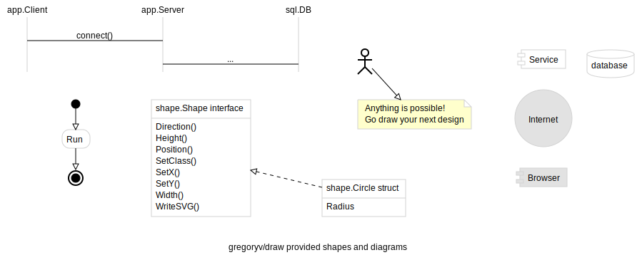

[draw](https://godoc.org/github.com/gregoryv/draw) - package for writing software design diagrams

- Cross platform
- No external dependencies
- SVG output
- Diagrams: [Sequence](design/#sequence-diagram), [Activity](design/#activity-diagram), [Class](design/#class-diagram) and [more...](design/#generic-diagram)

