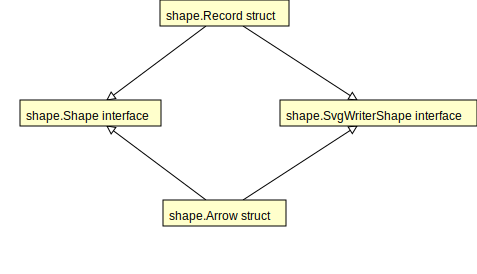

[go-design](https://godoc.org/github.com/gregoryv/go-design) - package for writing software design diagrams in code

Wouldn't it be nice if gofmt also updated all diagrams while you are
refactoring?  If the diagrams are code, it would. This package allows
you to easily create various diagrams as a program.

Automatic diagram rendering of packages are rarely useful as they are
to generic. The godoc information is far better to use when learning
about a package. However in larger projects it's of benefit to visualize
a subset of components and their interactions.

The goal however is to Not duplicate information, what's in code stays
in code.  This leads to less maintenance, ie. a diagram should only
need update if logic has changed or maybe the visual aspect is
affected somewhat.

As the examples below show, you can make them part of your test suit and
quickly verify that they are uptodate even after refactoring.

Diagrams and shapes are all in SVG which is good enough for most
purposes. Styling is kept separate although the default style should
evolve to the point where all other are just waste of time, much like
formating code is made pointless when using gofmt.

WIP - major refactorings still going on

## TODO

- Labeled arrows
- Optionally hide methods that implement an interface if it's part of
  the diagram, minimizing duplication.
- Link to optional godoc service
- More shapes
    - Note
    - Circle
- Calculate correct width of text elements based on font

## Class diagram

This diagram is rendered by
[example_test.go/ExampleClassDiagram](https://godoc.org/github.com/gregoryv/go-design/#example-ClassDiagram)

With hidden fields and methods and different placement.
This diagram is rendered by
[example_test.go/ExampleVerticalClassDiagram](https://godoc.org/github.com/gregoryv/go-design/#example-VerticalClassDiagram)

## Sequence diagram

From [example_test.go/ExampleSequenceDiagram](https://godoc.org/github.com/gregoryv/go-design/#example-SequenceDiagram)

## Generic diagram

It should be easy to just add any extra shapes to any diagram when explaining a design.
This diagram is rendered by
[example_test.go/ExampleDiagram](https://godoc.org/github.com/gregoryv/go-design/#example-Diagram)

