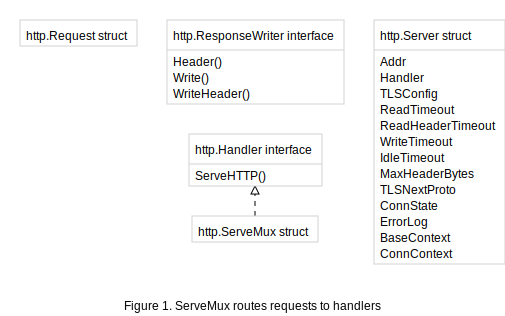
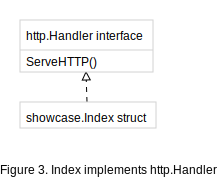

# Standard packages in pictures

Below diagrams cover basic concepts within the standard packages of go
as an illustration of what can be visualized.

## net/http

### net/http application

Here an application named App implements the http.Handler in a struct named Index.

