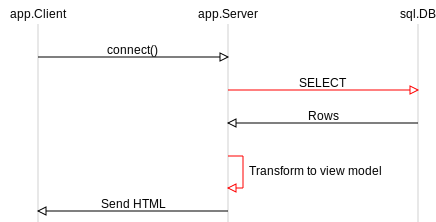
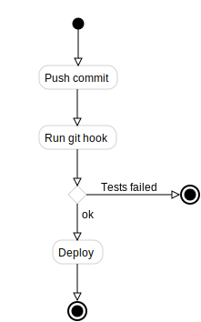
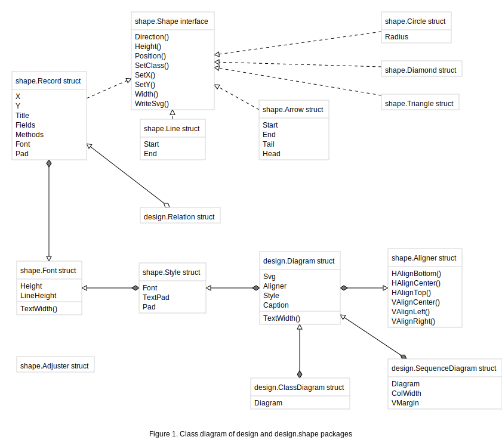
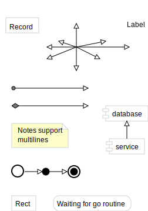

[design](https://godoc.org/github.com/gregoryv/draw/shape/design) - package for writing software design diagrams

## Sequence diagram

    var (
        d   = design.NewSequenceDiagram()
        cli = d.AddStruct(app.Client{})
        srv = d.AddStruct(app.Server{})
        db  = d.AddStruct(sql.DB{})
    )
    d.Link(cli, srv, "connect()")
    d.Link(srv, db, "SELECT").Class = "highlight"
    d.Link(db, srv, "Rows")
    d.Link(srv, srv, "Transform to view model").Class = "highlight"
    d.Link(srv, cli, "Send HTML")

## Activity diagram

Rendered by
[ExampleActivityDiagram](https://godoc.org/github.com/gregoryv/draw/shape/design/#example-ActivityDiagram)

## Class diagram

Class diagrams show relations between structs and
interfaces. Reflection includes fields and methods.

This diagram is rendered by
[ExampleClassDiagram](https://godoc.org/github.com/gregoryv/draw/shape/design/#example-ClassDiagram)

## Generic diagram

It should be easy to just add any extra shapes to any diagram when explaining a design.
This diagram is rendered by
[ExampleDiagram](https://godoc.org/github.com/gregoryv/draw/shape/design/#example-Diagram)

## Grid layout

Simplifying placing shapes in a grid layout aligning different sizes of shapes.

## Showcase

You can find more examples in the [showcase](showcase) folder.
